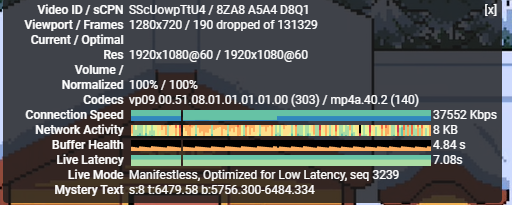

# Hi Hysteria
##### (2025/01/07) 1.0.0

```
脚本1.0.0之后从默认hysteria v1迁移到v2，v1的hihy不会再进行功能更新，仅作安全维护

1、新增查看hysteria2统计信息。包括当前在线用户、活动设备数量、用户所使用的流量统计、以及当前活跃链接等等信息
2、结果URL将会自动在终端输出一个QR CODE（二维码）方便用户保存使用，减少繁琐的复制粘贴过程
3、hysteria v2新增伪装功能，hihy提供三种模式（proxy、file、string），每种模式都有默认值，供用户选择与定制
4、和旧版相比支持alpine、Arch、Rockylinux、Alamalinux等所有主流的操作系统；x86_64、 i386|i686、aarch64|arm64、armv7、s390x、ppc64le架构，拥有更高的兼容性
5、修改port hopping规则持久化方式，放弃传统防火墙软件使用rc.d/init.d脚本控制，更广泛的兼容各类系统
6、支持域名ACL管理，能主动添加删除ipv4/ipv6分流域名，和屏蔽某一个域名，比如google.com
7、默认开启服务器端速度测试功能，可用客户端直接对server进行速度测试
8、新增ACME DNS支持。支持: Cloudflare、Duck DNS、Gandi.net、Godaddy、Name.com、Vultr
9、优化QUIC参数的计算方法，采用hysteria官方推荐流和连接接收窗口的2:5取代之前的1:4
10、使用自启脚本取代systemd守护进程，增加兼容性以及可拓展性
11、使用chrt调整高优先级启动hysteria2，最大程度的保证转发速度
12、修改自签证书默认域名，wechat.com -> apple.com(前者会被针对)
13、美化结果输出。现在打印结果时会更加美观和整齐。
```

[历史改进](md/log.md)

## 一·简介

> Hysteria2 是一个功能丰富的，专为恶劣网络环境进行优化的网络工具（双边加速），比如卫星网络、拥挤的公共 Wi-Fi、在**中国连接国外服务器**等。 基于修改版的 QUIC 协议。
> 
Hysteria2是一款由go编写的非常优秀的“轻量”代理程序，它很好的解决了在搭建富强魔法服务器时最大的痛点——**线路拉跨**。

1. CT直连落地JP NTT机房+cloudflare warp,无任何优化163线路，20-23点晚高峰测试speedtest。:
~~由于测试机器为lxc容器，因性能拉跨，CPU已经跑满，无法继续努力~~


2. 无对钟国大陆线路优化，洛杉矶shockhosting机房，1c128m ovznat 4k@p60：


```
139783 Kbps
```

**本仓库仅作学习用途，研究一种高抖动、高延迟网络环境的优化办法和解决方案，禁止用于违法行为，请遵守您所在地的法律。**

由它所引起的任何问题，作者并不承担风险和任何法律责任，请遵守GPL开源协议。

可能会有一些bug，如果遇到请发issue，欢迎star，您的⭐是我维护的动力。


## 二、本脚本的优点
- 支持hysteria2提供的三种masquerade伪装模式，并提供高度自定义伪装内容
- 提供四种证书导入方式。ACME HTTP挑战、ACME DNS、自签任意域名证书、本地证书
- 支持在ssh终端查看hysteria2 server统计信息。包括用户流量统计、在线设备数量、当前活跃的连接等等信息
- 提供仅通过ACL实现的分流域名规则，以及屏蔽相应域名的请求
- 支持当前市面上所有主流的操作系统与架构。包括Arch、Alpine、RHEL、Centos、AlamaLinux、Debian、Ubuntu、Rocky Linux等等操作系统，x86_64、 i386|i686、aarch64|arm64、armv7、s390x、ppc64le架构
- 支持对hy2分享链接生成二维码输出到终端，减少繁琐的复制粘贴过程，扫一扫更方便
- 支持生成hysteria2 original client配置文件，保留最全的客户端参数提供最佳的使用体验
- 使用高优先级启动hysteria2进程，尽可能的保持速度优先
- 端口跳跃与hysteria2的守护进程使用自启脚本管理，更强的拓展性以及兼容性
- 保留提供hysteria v1的安装脚本，供用户选择
- 计算BDP（带宽延迟积）来调整quic参数，适应多种多样的需求场景
- 更新及时，当hysteria2更新相应新功能时会在24h之内完成适配

## 三·使用

### 第一次使用?

#### 1. [防火墙问题](md/firewall.md)

#### 2. [自签证书](md/certificate.md)

#### 3. [限制UDP的服务商排雷列表【2025/01/07更新】](md/blacklist.md)

#### 4. [如何设置我的延迟、上、下行速度？](md/speed.md)

#### 6. [支持的客户端](md/client.md)

#### 7. [常见问题](md/issues.md)

#### 8. [启动一个伪装网站](md/masquerade.md)

### 拉取安装

```
su - root #switch to root user.
bash <(curl -fsSL https://git.io/hysteria.sh)
```

### 配置过程

首次安装后: `hihy`命令调出菜单,如更新了hihy脚本，请执行选项 `9`获得最新的配置

```
 -------------------------------------------
|**********      Hi Hysteria       **********|
|**********    Author: emptysuns   **********|
|**********     Version: 1.0.0     **********|
 -------------------------------------------
Tips: hihy  命令再次运行本脚本.
............................................. 
############################### 
..................... 
1)  安装 hysteria2 
2)  卸载 
..................... 
3)  启动 
4)  暂停 
5)  重新启动 
6)  运行状态 
..................... 
7)  更新Core 
8)  查看当前配置 
9)  重新配置 
10) 切换ipv4/ipv6优先级 
11) 更新hihy 
12) 域名分流/ACL管理 
13) 查看hysteria2统计信息 
14) 查看实时日志 
############################### 
0) 退出 
.............................................
```

**脚本每次更新都可能会发生改变，请一定要展开并仔细参考演示过程，避免发生不必要的错误！**

<details>
  <summary>演示较长，点我查看</summary>
<pre><blockcode> 

(1/11)请选择证书申请方式:

1、使用ACME申请(推荐,需打开tcp 80/443)
2、使用本地证书文件
3、自签证书
4、dns验证

输入序号:
3
请输入自签证书的域名(默认:apple.com): 
pornhub.a.com     
->自签证书域名为:pornhub.a.com 

判断客户端连接所使用的地址是否正确?公网ip:1.2.3.4
请选择:

1、正确(默认)
2、不正确,手动输入ip

输入序号:
1


->您已选择自签pornhub.a.com证书加密.公网ip:1.2.3.4


(2/11)请输入你想要开启的端口,此端口是server端口,推荐443.(默认随机10000-65535) 
并没有证据表明非udp/443的端口会被阻断,它仅仅是可能有更好的伪装一种措施,如果你使用端口跳跃的话，这里建议使用随机端口 
   

->使用随机端口:udp/43956 


->(3/11)是否使用端口跳跃(Port Hopping),推荐使用 
Tip: 长时间单端口 UDP 连接容易被运营商封锁/QoS/断流,启动此功能可以有效避免此问题.
更加详细介绍请参考: https://v2.hysteria.network/zh/docs/advanced/Port-Hopping/

选择是否启用:

1、启用(默认)
2、跳过

输入序号:


->您选择启用端口跳跃/多端口(Port Hopping)功能 
端口跳跃/多端口(Port Hopping)功能需要占用多个端口,请保证这些端口没有监听其他服务
Tip: 端口选择数量不宜过多,推荐1000个左右,范围1-65535,建议选择连续的端口范围.

请输入起始端口(默认47000): 
31000

->起始端口:31000 

请输入结束端口(默认48000): 
32000

->结束端口:32000 


->您选择的端口跳跃/多端口(Port Hopping)参数为: 31000:32000 

(4/11)请输入您到此服务器的平均延迟,关系到转发速度(默认200,单位:ms): 
280

->延迟:280 ms


期望速度,这是客户端的峰值速度,服务端默认不受限。Tips:脚本会自动*1.10做冗余，您期望过低或者过高会影响转发效率,请如实填写! 
(5/11)请输入客户端期望的下行速度:(默认50,单位:mbps): 
250

->客户端下行速度：250 mbps

(6/11)请输入客户端期望的上行速度(默认10,单位:mbps):
30

->客户端上行速度：30 mbps

(7/11)请输入认证口令(默认随机生成UUID作为密码,建议使用强密码): 


->认证口令:5a399adf-e12b-450b-8c39-ef11cc566179 

Tips: 如果使用obfs混淆,抗封锁能力更强,能被识别为未知udp流量。
但是会增加cpu负载导致峰值速度下降,如果您追求性能且未被针对封锁建议不使用
(8/11)是否使用salamander进行流量混淆:

1、不使用(推荐)
2、使用

输入序号:


->您将不使用混淆

(9/11)请选择伪装类型:

1、string(默认、返回一个固定的字符串)
2、proxy(作为一个反向代理，从另一个网站提供内容。)
3、file(作为一个静态文件服务器，从一个目录提供内容。目录内必须含有index.html)

输入序号:
2
请输入伪装代理地址(默认:https://www.helloworld.org): 
反代该网址但不会替换网页内域名
https://github.com

->伪装代理地址:https://github.com 

(10/11)是否同时监听tcp/43956端口来增强伪装行为(做戏做全套): 
通常网站支持 HTTP/3 的只是将其作为一个升级选项 
监听一个tcp端口来提供伪装内容,使伪装更加自然,如果不启用此选项,浏览器将在不启用H3功能下访问不了伪装内容
请选择:

1、启用(默认)
2、跳过

输入序号:


->您选择同时监听tcp/43956端口

(11/11)请输入客户端名称备注(默认使用域名或IP区分,例如输入test,则名称为Hys-test): 
test

配置录入完成!
 
执行配置... 
开始生成自签名证书...
 
生成 CA 私钥... 
Generating RSA private key, 2048 bit long modulus (2 primes)
生成 CA 证书... 
Can't load /root/.rnd into RNG
281012468479616:error:2406F079:random number generator:RAND_load_file:Cannot open file:../crypto/rand/randfile.c:88:Filename=/root/.rnd
生成服务器私钥和 CSR... 
Can't load /root/.rnd into RNG
280948454311552:error:2406F079:random number generator:RAND_load_file:Cannot open file:../crypto/rand/randfile.c:88:Filename=/root/.rnd
Generating a RSA private key
writing new private key to '/etc/hihy/cert/pornhub.a.com.key'
使用 CA 签署服务器证书... 
Signature ok
subject=C = CN, ST = GuangDong, L = ShenZhen, O = PonyMa, OU = Tecent, emailAddress = no-reply@qq.com, CN = pornhub.a.com
Getting CA Private Key
清理临时文件... 
移动 CA 证书到结果目录... 
证书生成成功！
 
net.core.rmem_max = 77000000
net.core.wmem_max = 77000000
net.ipv4.ip_forward = 1
net.ipv6.conf.all.forwarding = 1

Test config...

Test success! 
Port Hopping NAT 规则已添加并持久化。 
IPTABLES OPEN: udp/43956 
run-parts: executing /usr/share/netfilter-persistent/plugins.d/15-ip4tables save
run-parts: executing /usr/share/netfilter-persistent/plugins.d/25-ip6tables save
IPTABLES OPEN: tcp/43956 
run-parts: executing /usr/share/netfilter-persistent/plugins.d/15-ip4tables save
run-parts: executing /usr/share/netfilter-persistent/plugins.d/25-ip6tables save
Generating config... 
install.sh: line 305: 21873 Terminated              /etc/hihy/bin/appS -c ${yaml_file} server > ./hihy_debug.info 2>&1
安装成功,请查看下方配置详细信息 
Starting hihy...
启动成功! 

━━━━━━━━━━━━━━━━━━━━━━━━━━━━━━━━━━━━━━━━
📝 生成客户端配置文件...

✨ 配置信息如下:

📌 当前hysteria2 server版本: app/v2.6.0 
━━━━━━━━━━━━━━━━━━━━━━━━━━━━━━━━━━━━━━━━

⚠️  安全提示:
🔒 您使用自签证书,需要:
   1. 自行修改浏览器信任证书
   2. 设置hosts使IP指向该域名

🌐 1、伪装地址: https://1.2.3.48:43956  

🔗 2、[v2rayN-Windows/v2rayN-Andriod/nekobox/passwall/Shadowrocket]分享链接:
 
hy2://5a399adf-e12b-450b-8c39-ef11cc566179@1.2.3.48:43956/?mport=31000-32000&insecure=1&sni=pornhub.a.com#Hy2-test 


█ ▄▄▄▄▄ █▀▀▄▄▄██  █ ▀▀▄▄▄ █▄▀▀█▄▄▄█ ▄▄▄▄▄ █

QR code generated successfully. 

📄 3、[推荐] [Nekoray/V2rayN/NekoBoxforAndroid]原生配置文件,更新最快、参数最全、效果最好。文件地址: ./Hy2-test-v2rayN.yaml  
↓↓↓↓↓↓↓↓↓↓↓↓↓↓↓↓↓↓↓COPY↓↓↓↓↓↓↓↓↓↓↓↓↓↓↓↓↓↓↓ 
server: hysteria2://5a399adf-e12b-450b-8c39-ef11cc566179@1.2.3.48:43956,31000-32000/
tls:
  sni: pornhub.a.com
  insecure: true
transport:
  type: udp
  udp:
    hopInterval: 120s
quic:
  initStreamReceiveWindow: 15400000
  initConnReceiveWindow: 38500000
  maxConnReceiveWindow: 77000000
  maxStreamReceiveWindow: 30800000
  keepAlivePeriod: 60s
bandwidth:
  download: 250mbps
  upload: 30mbps
fastOpen: true
socks5:
  listen: 127.0.0.1:20808
↑↑↑↑↑↑↑↑↑↑↑↑↑↑↑↑↑↑↑COPY↑↑↑↑↑↑↑↑↑↑↑↑↑↑↑↑↑↑↑ 

📱 4、[Clash.Mini/ClashX.Meta/Clash.Meta for Android/Clash.verge/openclash] ClashMeta配置文件地址: ./Hy2-test-ClashMeta.yaml  

✅ 配置生成完成!
━━━━━━━━━━━━━━━━━━━━━━━━━━━━━━━━━━━━━━━━

配置修改成功 
root@localhost:/opt/test# hihy 14
-> 14) 查看实时日志 
2025-01-07T14:53:16Z    INFO    server mode
2025-01-07T14:53:16Z    INFO    traffic stats server up and running     {"listen": "127.0.0.1:19215"}
2025-01-07T14:53:16Z    INFO    masquerade HTTPS server up and running  {"listen": ":43956"}
2025-01-07T14:53:16Z    INFO    server up and running   {"listen": ":43956"}
^C
root@localhost:/opt/test# hihy 13
-> 13) 查看hysteria统计信息 
=========== Hysteria 服务器状态 ===========
【流量统计】 

【在线用户】 

【活动连接】 
当前没有活动连接

</blockcode></pre>`

</details>

## 四·Todo

**如果您有好的功能建议，请不要忘记开个issue提出来欧～～～欢迎PR来完成Todo或者给我纠正我的渣代码**

**我的爱好是写bug （￣▽￣）~**


* [ ] 多用户管理。包括踢用户下线、添加新的用户等等

## 五·结语

Hysteria2在高延迟，高丢包网络环境下表现良好，得益于它自创的暴力拥塞控制算法。
这为我们研究相应恶劣的网络环境做出了贡献，本仓库目的是在研究这种恶劣网络环境时给予各位研究人员配置hysteria2的方便，原则上所有hysteria2提供的功能，我们都会支持自定义配置，提供高度定制化内容。
如果您觉得对您学习shell有所帮助，请帮本仓库点一个小小的⭐来让更多人看到本仓库。
**不接受任何形式的打赏和广告赞助，请不要浪费issue的曝光机会**


## 六·鸣谢

[@apernet/hysteria](https://github.com/HyNetwork/hysteria)

[@2dust/v2rayN](https://github.com/2dust/v2rayN)

[@MetaCubeX/Clash.Meta](https://github.com/MetaCubeX/Clash.Meta)