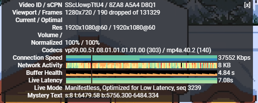

# Hi Hysteria

[English](README_en.md) | [中文](README.md) | **فارسی** | [Русский](README_ru.md)

##### (2026/07/07) ver1.12

```
بازنویسی ماژولار؛ پشتیبانی چندزبانه i18n (en/zh/fa/ru)؛ رفع اشکالات پیکربندی mihomo (ازدحام/gecko/hop-interval/Realm) + تغییر نام؛ تولید پیکربندی کلاینت sing-box جدید
```


[حالت Realm سوراخ‌کردن P2P — استفاده از Hysteria2 پشت NAT، حتی رله از طریق Cloudflare](md/realm.md)


سوالی دارید یا می‌خواهید تجربیات خود را به اشتراک بگذارید؟ به گروه تلگرام ما بپیوندید:
[](https://hihysteria.t.me)

[تاریخچه تغییرات](md/logs.md)

[نسخه Hysteria V1](https://github.com/emptysuns/Hi_Hysteria/tree/v1)

## ۱. معرفی

> Hysteria2 یک ابزار شبکه قدرتمند بهینه‌سازی شده برای محیط‌های شبکه نامساعد (شتاب‌دهی دوطرفه) است — لینک‌های ماهواره‌ای، Wi-Fi عمومی شلوغ، **اتصال به سرورهای خارج از چین** و غیره. مبتنی بر پروتکل QUIC اصلاح‌شده.
> 
بزرگترین مشکل در راه‌اندازی سرورهای پروکسی — **مسیرهای شبکه بی‌کیفیت** — را حل می‌کند.

۱. China Telecom مستقیم به NTT ژاپن + Cloudflare WARP، بدون بهینه‌سازی مسیر 163، تست سرعت در ساعات اوج (۲۰:۰۰-۲۳:۰۰):

~~توجه: ماشین تست یک کانتینر LXC است — CPU به دلیل محدودیت‌های عملکردی کاملاً اشباع شده~~



۲. بدون مسیریابی بهینه‌شده برای چین، ShockHosting لس‌آنجلس، 1c128m OVZ NAT، 4K@60fps:


```
139783 Kbps
```

**این مخزن صرفاً برای اهداف آموزشی است — تحقیق در مورد روش‌های بهینه‌سازی برای محیط‌های شبکه با نوسان و تأخیر بالا. استفاده غیرقانونی ممنوع است. لطفاً قوانین محلی خود را رعایت کنید.**

نویسنده هیچ مسئولیت یا تعهد قانونی در قبال مشکلات ناشی از این نرم‌افزار نمی‌پذیرد. لطفاً مجوز متن‌باز GPL را رعایت کنید.

ممکن است باگ‌هایی وجود داشته باشد — لطفاً در صورت مشاهده issue ثبت کنید. ستاره‌ها welcome! ⭐ شما این پروژه را زنده نگه می‌دارد.


## ۲. ویژگی‌ها

<details>
<summary><b>برای مشاهده لیست کامل ویژگی‌ها کلیک کنید</b></summary>

* پشتیبانی از هر سه حالت نقاب‌دار ارائه‌شده توسط Hysteria2 با محتوای بسیار قابل تنظیم
* چهار روش وارد کردن گواهی:
  * ACME HTTP Challenge
  * ACME DNS
  * گواهی خودامضا برای هر دامنه
  * فایل‌های گواهی محلی
* مشاهده آمار سرور Hysteria2 در ترمینال SSH:
  * آمار ترافیک کاربران
  * تعداد دستگاه‌های آنلاین
  * اتصالات فعال و موارد دیگر
* قوانین مسیریابی دامنه مبتنی بر ACL با پشتیبانی از مسدودسازی دامنه
* پشتیبانی از تمام سیستم‌عامل‌ها و معماری‌های رایج:
  * سیستمعامل: Arch, Alpine, RHEL, CentOS, AlmaLinux, Debian, Ubuntu, Rocky Linux و غیره
  * معماری: x86_64, i386/i686, aarch64/arm64, armv7, s390x, ppc64le
* تولید کد QR برای لینک‌های اشتراک‌گذاری hy2 مستقیماً در ترمینال — بدون دردسر کپی-پیست
* تولید فایل‌های پیکربندی اصلی کلاینت Hysteria2 با مجموعه کامل پارامترهای کلاینت
* راه‌اندازی فرآیند با اولویت بالا برای Hysteria2 — اولویت با سرعت
* پرش پورت و دیمن Hysteria2 از طریق اسکریپت‌های شروع خودکار مدیریت می‌شوند برای گسترش‌پذیری و سازگاری بهتر
* اسکریپت نصب Hysteria v1 به عنوان یک گزینه حفظ شده است
* محاسبه BDP (حاصل‌ضرب پهنای‌باند-تأخیر) برای تنظیم پارامترهای QUIC برای سناریوهای متنوع
* پشتیبانی از خروجی SOCKS5، از جمله راه‌اندازی خودکار خروجی WARP
* پشتیبانی از LXC، OpenVZ، KVM و تمام پلتفرم‌های مجازی‌سازی رایج
* حالت Realm (سوراخ‌کردن P2P) — برقراری ارتباط بدون IP عمومی یا ارسال پورت
* Realm از طریق Cloudflare WARP — اتصال به Hysteria2 از طریق IP WARP، مخفی‌سازی IP واقعی سرور (عملاً پشت CF CDN)
* به‌روزرسانی‌های به‌موقع — سازگاری ظرف ۲۴ ساعت پس از انتشار Hysteria2

</details>

## ۳. استفاده

### اولین استفاده؟

#### ۱. [راهنمای فایروال](md/firewall.md)

#### ۲. [گواهی‌های خودامضا](md/certificate.md)

#### ۳. [لیست سیاه ISPهای محدودکننده UDP (به‌روزرسانی ۲۰۲۵/۰۱/۰۷)](md/blacklist.md)

#### ۴. [نحوه تنظیم تأخیر / سرعت آپلود / دانلود](md/speed.md)

#### ۵. [کلاینت‌های پشتیبانی‌شده](md/client.md)

#### ۶. [سوالات متداول / عیب‌یابی](md/issues.md)

#### ۷. [فعال‌سازی وبسایت نقاب‌دار](md/masquerade.md)

#### ۸. [حالت Realm — سوراخ‌کردن P2P](md/realm.md)

### نصب سریع

```
su - root # تغییر به کاربر root.
bash <(curl -fsSL https://git.io/hysteria.sh)
```

### پیکربندی

پس از اولین نصب: دستور `hihy` را اجرا کنید تا منو باز شود. اگر اسکریپت hihy را به‌روزرسانی کرده‌اید، از گزینه `9` برای دریافت آخرین پیکربندی استفاده کنید.

می‌توانید مستقیماً توابع را با شماره فراخوانی کنید، مثلاً `hihy 5` hysteria2 را راه‌اندازی مجدد می‌کند.

```
 -------------------------------------------
|**********      Hi Hysteria       **********|
|**********    Author: emptysuns   **********|
|**********   Version: ver1.12     **********|
 -------------------------------------------
نکته: دستور hihy  برای اجرای مجدد این اسکریپت.
............................................. 
############################### 
..................... 
۱)  نصب hysteria2 
۲)  حذف 
..................... 
۳)  شروع 
۴)  توقف 
۵)  راه‌اندازی مجدد 
۶)  وضعیت 
..................... 
۷)  به‌روزرسانی هسته 
۸)  مشاهده پیکربندی 
۹)  پیکربندی مجدد 
۱۰) تغییر اولویت IPv4/IPv6 
۱۱) به‌روزرسانی hihy 
۱۲) مسیریابی دامنه ACL 
۱۳) مشاهده آمار 
۱۴) مشاهده لاگ‌ها 
۱۵) افزودن خروجی SOCKS5 [پیکربندی خودکار WARP] 
############################### 
۰)  خروج 
............................................. 
لطفاً انتخاب کنید:
```

**اسکریپت ممکن است با هر به‌روزرسانی تغییر کند. لطفاً برای جلوگیری از خطاهای غیرضروری، نمایش را باز کرده و با دقت بررسی کنید!**


> **توجه:** نمایش زیر یک ضبط از رابط چینی است. با پشتیبانی i18n (ver1.12+)، اسکریپت اکنون به زبان انتخابی شما (en/zh/fa/ru) نمایش داده می‌شود.
<details>
  <summary>نمایش طولانی — برای مشاهده کلیک کنید (ضبط ترمینال، رابط چینی)</summary>
<pre><blockcode> 

请选择: 1
Ready to install.
 
The Latest hysteria version: app/v2.9.1 
Download...

Download completed. 
开始配置: 
(0/13)是否使用Realm模式(P2P穿透,无需公网IP):


Realm是Hysteria2的P2P穿透模式,通过牵手(rendezvous)服务器介绍双方进行UDP打洞,
打洞成功后流量直连,不经过牵手服务器。服务器无需公网IP、无需端口转发即可运行。
适用: NAT/家庭宽带/CGNAT/无公网IP环境。详情: https://hysteria.network/zh/docs/advanced/Realms/
⚠ 目前仅支持使用hysteria core直接运行

1、不使用(默认)
2、使用Realm模式

输入序号:
2

->您的Realm名(请勿泄露,知道此名称的人可以获得你的服务器ip地址): ab747d7f-03a7-4bf7-982c-79967bae7056 


请选择牵手(rendezvous)服务器: 
官方服务器地址为 realm.hy2.io, 使用默认密码 public 即可,无需修改
1、官方牵手服务器(默认): realm.hy2.io
2、自建牵手服务器

输入序号:
1

->牵手地址: realm://public@realm.hy2.io/ab747d7f-03a7-4bf7-982c-79967bae7056 


(可选)是否安装服务器全局WARP[fscarmen]通过Cloudflare WARP IP打洞连接Hysteria2? 
原理: WARP通过WireGuard协议接入Cloudflare全球边缘网络,为服务器分配WARP IP。
Hysteria2利用该WARP IP进行Realm打洞,客户端实际连接到Cloudflare边缘节点,
从而隐藏服务器真实IP,相当于变相在Cloudflare CDN上使用Hysteria2。
前提: 服务器需支持WireGuard内核模块,安装过程全自动。
注意: 安装后服务器出站流量将经过Cloudflare WARP,不影响Hysteria2入站。
1、安装WARP
2、跳过(默认)

输入序号:

1

->开始安装WARP,请稍候... 
请在WARP安装菜单中选择 [全局] 工作模式(出现菜单时手动选择全局) 
 
 Language:
 1. English (default) 
 2. 简体中文 

 Choose: 2

 所有依赖已存在，不需要额外安装 

 检查环境中…… 

 请选择 wireguard 方式:
 1. wireguard 内核 (默认)
 2. wireguard-go with reserved 

 请选择: 

 工作模式:
 1. 全局 (默认)
 2. 非全局 

 请选择: 1

 请选择优先级别:
 1. IPv4
 2. IPv6
 3. 使用 VPS 初始设置 (默认) 

 请选择: 

 进度 1/3: 安装系统依赖…… 


 进度 3/3: 寻找 MTU 最优值已完成 

 创建快捷 warp 指令成功 
 运行 WARP 
 后台获取 WARP IP 中,最大尝试5次……
 第1次尝试 
 已成功获取 WARP Free 网络, 工作模式: 全局 

==============================================================

 IPv4: 104.28.193.129 罗马尼亚  AS13335 Cloudflare, Inc. 
 IPv6: 2a09:bac1:6080:8::3cc:7 罗马尼亚  AS13335 Cloudflare, Inc. 
 恭喜！WARP Free 已开启 
 总耗时: 7秒，脚本当天运行次数: 1644，累计运行次数: 75059150 
 IPv6 优先 , 工作模式: 全局 

==============================================================

 再次运行用 warp [option] [lisence]，如 

 warp h (帮助菜单）
 warp n (获取 WARP IP)
 warp o (临时warp开关)
 warp u (卸载 WARP 网络接口和 Socks5 Client)
 warp b (升级内核、开启BBR及DD)
 warp v (同步脚本至最新版本)
 warp r (WARP Linux Client 开关)
 warp 4/6 (WARP IPv4/IPv6 单栈)
 warp d (WARP 双栈)
 warp c (安装 WARP Linux Client，开启 Socks5 代理模式)
 warp l (安装 WARP Linux Client，开启 WARP 模式)
 warp i (更换支持 Netflix 的IP)
 warp e (安装 Iptables + dnsmasq + ipset 解决方案)
 warp w (安装 WireProxy 解决方案)
 warp y (WireProxy socks5 开关)
 warp k (切换 wireguard 内核 / wireguard-go-reserved)
 warp g (切换 warp 全局 / 非全局)
 warp s 4/6/d (优先级: IPv4 / IPv6 / VPS default)
 

->当前MTU=1340,无需调整(≥1320) 

->正在开启WARP... 
 已暂停 WARP，再次开启可以用 warp o 

->正在重新开启WARP以确保连接稳定... 
 后台获取 WARP IP 中,最大尝试5次……
 第1次尝试 
 已成功获取 WARP Free 网络, 工作模式: 全局 
 IPv4:104.28.193.129 罗马尼亚 AS13335 Cloudflare, Inc.
 IPv6:2a09:bac1:60a0:8::3cc:5d 罗马尼亚 AS13335 Cloudflare, Inc. 

->WARP安装完成,Hysteria2将通过Cloudflare WARP IP打洞连接 
(1/11)请选择证书申请方式:

1、使用ACME申请(推荐,需打开tcp/80端口)
2、使用本地证书文件
3、自签证书
4、dns验证

输入序号:
3
请输入自签证书的域名(默认:helloworld.com): 

->自签证书域名为:helloworld.com 


->牵手地址: realm://public@realm.hy2.io/ab747d7f-03a7-4bf7-982c-79967bae7056 


->您已选择自签helloworld.com证书加密.牵手地址:realm://public@realm.hy2.io/ab747d7f-03a7-4bf7-982c-79967bae7056 


->Realm模式无需配置端口,跳过端口设置
 

->Realm模式无需端口跳跃,跳过此设置
 
(4/13)请选择拥塞控制模式: 
Reno: 更保守、更稳，适合优先考虑兼容性和稳定性的场景
BBR: 更积极，通常吞吐更高，适合追求速度的场景
Brutal: Hysteria 2 独享特色，固定速率模型，在恶劣网络环境下通常更值得优先尝试，尤其适合已知链路真实带宽、希望获得更强抗抖动和抢带宽能力的场景
请选择:

1、Reno(保守)
2、BBR(均衡)
3、Brutal(激进,默认)

输入序号:


->您选择的拥塞控制模式: Brutal 

(5/13)请输入您到此服务器的平均延迟,用于 Brutal 模式下估算 QUIC 窗口(默认200,单位:ms): 
200

->延迟:200 ms


期望速度,这是客户端在 Brutal 模式下使用的目标带宽。Tips:脚本会自动*1.10做冗余，带宽不要高于真实链路极限，否则反而可能更不稳定! 
(6/13)请输入客户端期望的下行速度:(默认50,单位:mbps): 
200

->客户端下行速度：200 mbps

(7/13)请输入客户端期望的上行速度(默认10,单位:mbps):
40

->客户端上行速度：40 mbps

(8/13)请输入认证口令(默认随机生成UUID作为密码,建议使用强密码): 


->认证口令:a754799f-ac2a-46ff-b82a-d6141b1a2769 

Tips: 如果使用obfs混淆,抗封锁能力更强,能被识别为未知udp流量。
但是会增加cpu负载导致峰值速度下降,如果您追求性能且未被针对封锁建议不使用
(9/13)是否使用流量混淆:

1、不使用(推荐)
2、salamander - 将数据包混淆为无特征随机字节
3、gecko(实验性) - 在salamander基础上额外拆分QUIC握手包，抗检测更强

输入序号:


->您将不使用混淆


(12/13)是否在服务器屏蔽http3流量(hysteria对udp流量拥塞控制无增强效果，导致访问youtube等使用QUIC连接的网站效果不佳): 
如果开启此选项，hysteria2将不会代理udp/443，无法使用QUIC连接访问网站，并且需要在客户端配置中禁用QUIC连接，否则会导致连接失败。
 
也可以仅在客户端屏蔽QUIC/HTTP3/UDP 443连接，服务器不做屏蔽，效果一样

请选择:

1、启用(推荐)
2、跳过(默认)

输入序号:
2

->您选择不屏蔽http3流量，这会导致访问使用QUIC连接的网站无hy2增强效果

Tip: 建议在客户端开启屏蔽QUIC/HTTP3/UDP 443此选项以获得更好的访问体验。
 
(13/13)请输入客户端名称备注(默认使用域名或IP区分,例如输入test,则名称为Hy2-test): 
roms

配置录入完成!
 
执行配置... 
开始生成自签名证书...
 
生成 CA 私钥... 
生成 CA 证书... 
生成服务器私钥和 CSR... 
使用 CA 签署服务器证书... 
Certificate request self-signature ok
subject=C=CN, ST=GuangDong, L=ShenZhen, O=PonyMa, OU=Tecent, emailAddress=no-reply@qq.com, CN=helloworld.com
清理临时文件... 
移动 CA 证书到结果目录... 
证书生成成功！
 
net.core.rmem_max = 132000000
net.core.wmem_max = 132000000

Test config...

⏰ 倒计时:  
✨ 完成!
Test success! 
Stop test program... 
Generating config... 
安装成功,请查看下方配置详细信息 
Starting hihy...

━━━━━━━━━━━━━━━━━━━━━━━━━━━━━━━━━━━━━━━━
📝 生成客户端配置文件...

✨ 配置信息如下:

📌 当前hysteria2 server版本: app/v2.9.1 
━━━━━━━━━━━━━━━━━━━━━━━━━━━━━━━━━━━━━━━━

🌐 Realm模式 - 服务器通过P2P打洞连接,无需公网IP和端口 

🔗 1、牵手地址: 
  realm://public@realm.hy2.io/ab747d7f-03a7-4bf7-982c-79967bae7056 


⚠ 请确保您的客户端支持Hysteria2 Realm模式 
客户端配置中server字段使用上述牵手地址,认证密码为: a754799f-ac2a-46ff-b82a-d6141b1a2769 


🔗 2、[hysteria2+realm 分享链接] 适用于支持 Realm URI 的客户端: 
  hysteria2+realm://public@realm.hy2.io/ab747d7f-03a7-4bf7-982c-79967bae7056?auth=a754799f-ac2a-46ff-b82a-d6141b1a2769&pinSHA256=BA:88:45:17:A1...&obfs=salamander&obfs-password=...&sni=helloworld.com#Hy2-roms 

提示: Realm模式暂不支持ClashMeta配置,请使用上方分享链接或原生配置文件。 

📄 3、[推荐] [Nekoray/V2rayN/NekoBoxforAndroid]原生配置文件,更新最快、参数最全、效果最好。文件地址: ./Hy2-roms-v2rayN.yaml  
客户端使用教程: https://github.com/emptysuns/Hi_Hysteria/blob/main/md/client.md 
↓↓↓↓↓↓↓↓↓↓↓↓↓↓↓↓↓↓↓COPY↓↓↓↓↓↓↓↓↓↓↓↓↓↓↓↓↓↓↓ 
server: realm://public@realm.hy2.io/ab747d7f-03a7-4bf7-982c-79967bae7056
auth: a754799f-ac2a-46ff-b82a-d6141b1a2769
tls:
  sni: helloworld.com
  insecure: false
  pinSHA256: BA:88:45:17:A1...
transport:
  type: udp
obfs:
  type: salamander
  salamander:
    password: null
quic:
  initStreamReceiveWindow: 35200000
  initConnReceiveWindow: 88000000
  maxConnReceiveWindow: 132000000
  maxStreamReceiveWindow: 52800000
  keepAlivePeriod: 60s
bandwidth:
  down: 220mbps
  up: 44mbps
fastOpen: true
lazy: true
socks5:
  listen: 127.0.0.1:20808
↑↑↑↑↑↑↑↑↑↑↑↑↑↑↑↑↑↑↑COPY↑↑↑↑↑↑↑↑↑↑↑↑↑↑↑↑↑↑↑ 

✅ 配置生成完成!
━━━━━━━━━━━━━━━━━━━━━━━━━━━━━━━━━━━━━━━━


</blockcode></pre>

</details>

## ۴. برنامه‌ها

**اگر پیشنهادی برای ویژگی جدید دارید، لطفاً issue ثبت کنید! PR برای افزودن موارد به برنامه یا اصلاح کد من welcome است.**

**سرگرمی من نوشتن باگ است (￣▽￣)~**


* [ ] مدیریت چند کاربره: قطع اجباری کاربران، افزودن کاربران جدید و غیره.

## ۵. نتیجه‌گیری

Hysteria2 در محیط‌های با تأخیر بالا و اتلاف بسته بالا، به لطف الگوریتم کنترل ازدحام Brutal اختصاصی خود، عملکرد خوبی دارد.

این به تحقیق در مورد محیط‌های شبکه چالش‌برانگیز کمک می‌کند. هدف این مخزن کمک به محققان برای پیکربندی آسان Hysteria2 است. در اصل، ما از پیکربندی سفارشی برای تمام ویژگی‌های Hysteria2 پشتیبانی می‌کنیم و تنظیمات بسیار قابل تنظیم ارائه می‌دهیم.

اگر این به یادگیری اسکریپت‌نویسی shell به شما کمک کرد، لطفاً یک ⭐ کوچک به این مخزن بدهید تا افراد بیشتری آن را کشف کنند.

**هیچ نوع کمک مالی یا اسپانسری تبلیغاتی پذیرفته نمی‌شود. لطفاً فرصت‌های نمایش issue را هدر ندهید.**


## ۶. قدردانی

[@apernet/hysteria](https://github.com/HyNetwork/hysteria)

[@2dust/v2rayN](https://github.com/2dust/v2rayN)

[@MetaCubeX/Clash.Meta](https://github.com/MetaCubeX/Clash.Meta)

[@fscarmen/warp](https://gitlab.com/fscarmen/warp)
