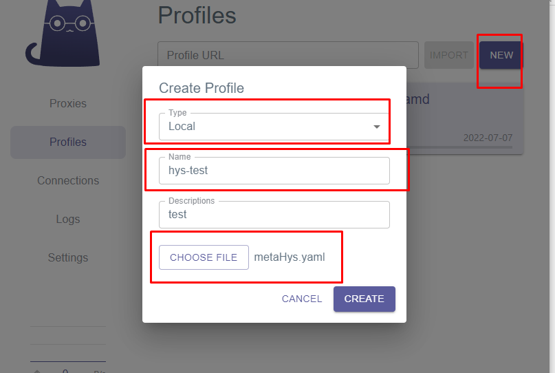
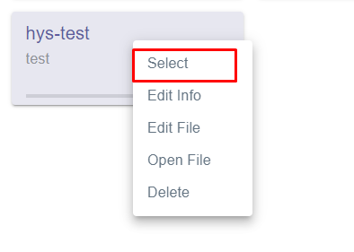
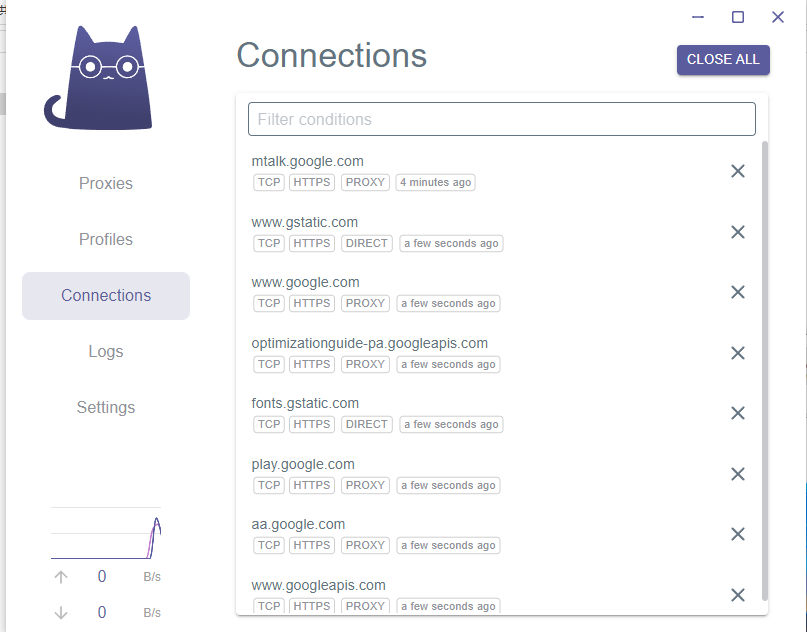

# 支持的客户端

**所有客户端为了连接速度最好填上** `recv_window_conn`  `recv_window`，使用一键链接时无法导入这两个参数，如果使用生成的v2rayN和clash.meta配置文件则不用担心，passwall和nekoray等由链接导入需要手动填写。

- [支持的客户端](#支持的客户端)
  - [1. Clash.Meta](#1-clashmeta)
    - [介绍](#介绍)
    - [优点](#优点)
    - [使用](#使用)
  - [2. v2rayN【推荐】](#2-v2rayn推荐)
  - [3. matsuri \[android\]](#3-matsuri-android)
  - [4. openwrt passwall](#4-openwrt-passwall)
  - [5. openclash](#5-openclash)
  - [6. NekoRay \[@QIN2DIM\]](#6-nekoray-qin2dim)
    - [6.0 项目简介](#60-项目简介)
    - [6.1 下载 NekoRay](#61-下载-nekoray)
    - [6.2 下载 hysteria-core-windows](#62-下载-hysteria-core-windows)
    - [6.3 配置 NekoRay 代理核心](#63-配置-nekoray-代理核心)
    - [6.4 导入 hysteria 节点](#64-导入-hysteria-节点)
      - [6.4.1 从分享链接或剪切板添加](#641-从分享链接或剪切板添加)
      - [6.4.2 手动编辑](#642-手动编辑)
    - [6.5 启动 hysteria 节点](#65-启动-hysteria-节点)
    - [6.6 \[选读\]测试 hysteria 节点](#66-选读测试-hysteria-节点)
    - [参考资料](#参考资料)
  - [7. shadowrocket](#7-shadowrocket)
  - [8. ~~hihy\_cmd~~](#8-hihy_cmd)

## 1. [Clash.Meta](https://github.com/emptysuns/Hi_Hysteria/releases/latest)

### 介绍

[clash.meta](https://github.com/MetaCubeX/Clash.Meta/releases/tag/Prerelease-Alpha) 继承了clash的所有特点，所以clash能用的GUI，它全部可以使用，包括openclash、clash verge、ClashForWindows等等。

推荐使用[Alpha](https://github.com/MetaCubeX/Clash.Meta/releases/tag/Prerelease-Alpha)分支，同步最新代码。

更多支持clash.meta的客户端参考[这里](https://docs.metacubex.one/used)，hihy提供打包好的clash.verge 请在release查看, android端[查看](https://github.com/MetaCubeX/ClashMetaForAndroid/releases/tag/Prerelease-alpha)。

### 优点

它有许多hysteria core无法完成但是必要的功能。比如:

1. `type: url-test`可以自动根据httping选择节点
2. 而且得益于 `rule-providers`这个clash配置项，用户不需要手动更新分流规则，每次连接都会自动更新，能做到完全无感。
3. 使用doh dot增加安全性，也能单独为dns配置节点
4. fallback 测试节点可用性并自动切换、负载均衡
5. GUI全平台都有很好的支持
6. 流媒体分流
7. .....

### 使用

hihy不支持生成clash.meta url导入远程配置文件，主要是考虑到安全问题，防止节点信息泄露，**需要用户复制粘贴到客户端自己本地文件，导入配置**

这里用clash_verge 为例,随意创建一个文件夹用来保存metaHys.yaml:

**测试**

clash.meta可以同时配置支持vless、ss2022、trojan等等多配置，不过hihy目前不支持，没好的想法，更多配置请参考[DOC](https://docs.metacubex.one/example/ex1)。

目前许多优秀的特点hihy输出的配置文件没有支持，尽情期待 ～d=v=b～

## 2. v2rayN【推荐】

v2rayN已经在添加自定义配置时支持hysteria并能自动识别config的类型，hihy在 `0.3.7`版本之后兼容v2rayN，hihy_cmd已经需要退出舞台了，**不会再对它进行维护**。

如果想要及时体验最新的配置，建议使用这个工具。

我将如何使用呢?

你也可以直接下载我打包好的[v2rayN-hysteriaCore](https://github.com/emptysuns/Hi_Hysteria/releases/latest)，可忽略下方的配置v2n的过程。

**v2rayN升级至6.0以上版本和老版本配置不同，5.39以下版本请参照下方隐藏信息，选择最新6.0以上可以跳过:**

1. [点我下载](https://github.com/2dust/v2rayN/releases/latest/download/v2rayN.zip)最新的v2rayN，并解压。
2. [点我下载](https://github.com/apernet/hysteria/releases/)hysteria最新版本的Core，修改名称为 `hysteria.exe`,将它放到v2rayN的根目录里。
3. 使用提供的[脚本](https://github.com/emptysuns/Hi_Hysteria/tree/main/acl)生成acl文件和Country.mmdb文件,在v2rayN根目录创建一个新的文件夹名称为 `acl`并将这两个文件放到这个目录里。
4. 开始使用时需要得到hihy生成的config.json配置文件，v2rayN选择这个文件，双击选择此节点。如下图:

* **保证有core和acl文件**
  
  
* **配置v2rayN hysteria**
  
  
  
  
  
  
* **看到下图则说明代理正常运行v2rayN hysteria**
  
* **从服务器下载的config.json可以删掉，v2rayN会自动在目录创建文件夹用来保存这些自定义配置文件**
  

5. **Hello World！**

**6.0以上版本:**
由于6.0以上的版本v2rayN会把hysteria core打包进去 `v2rayN-Core\bin\hysteria`，所以我们不需要再自己下载core再手动放进去了，但是更新时仍然要自己手动下载core替换

所以我们只需要把hysteria的ACL文件放到 `guiConfigs/acl/`文件夹里，例如:

**如果没有这两个文件夹，自己在v2rayN根目录分别新建 `guiConfigs/` , `guiConfigs/acl/`就行**

* [routes.acl](https://github.com/emptysuns/Hi_Hysteria/raw/main/acl/routes.acl) #hysteria 分流规则
* [Country.mmdb](https://github.com/emptysuns/Hi_Hysteria/raw/main/acl/Country.mmdb) #GeoIP文件

  

  当然release里面的是已经打包好ACL的，不然会报错没有ACL文件导致无法正常启动

## 3. [matsuri](https://github.com/MatsuriDayo/Matsuri/releases) [android]

  Sagernet已经很久不更新了，建议更换它的魔改分支Matsuri,由[https://matsuridayo.github.io/](https://matsuridayo.github.io/) 维护

  可通过一键链接导入，但是无法导入缓冲区，需要手动输入 `recv_window_conn`  `recv_window` 参数

  安装[hysteria-plugin](https://github.com/MatsuriDayo/plugins/releases)并**允许该插件被其他应用启动**，否则提示启动失败（tips: [matsuri](https://github.com/MatsuriDayo/Matsuri/releases)支持直接剪切板导入hysteria的json配置文本）

## 4. openwrt passwall

只能在编译固件时加进去，请op刷到最新版本,才会支持hysteria，对应config.json看下面

支持一键导入，也是需要手动填入缓冲区配置和端口跳跃地址

## 5. openclash

待补充或者请您提交pr

## 6. NekoRay [[@QIN2DIM](https://github.com/QIN2DIM)]

**目录**

### 6.0 项目简介

[NekoRay](https://github.com/MatsuriDayo/nekoray) —— 基于 Qt/C++ 的跨平台代理配置管理器，是一个仍处于成长期的开源项目。NekoRay 先于 V2rayN 支持了 `hysteria://` 协议头的解析，玩家可通过节点分享链接批量导入 hysteria 节点。此外，NekoRay 巧妙地实现了「节点激活 + 节点测试」的 action 集成交互，可以基于组的形式管理和测试 hysteria 节点而无需手动配置 socks5 监听器。

NekoRay 目前支持 Windows / Linux amd64。下文以 NekoRay v1.5 Windows 为例介绍客户端的快速入坑步骤。

### 6.1 下载 NekoRay

进入 [Releases · MatsuriDayo/nekoray](https://github.com/MatsuriDayo/nekoray/releases)，下载最新版的 NekoRay Windows 压缩包。免安装，开箱即用。此处假设解压目录为 `C:\\nekoray`，则主程序路径为 `C:\\nekoray\\nekoray.exe`。

### 6.2 下载 hysteria-core-windows

进入 [Releases · HyNetwork/hysteria](https://github.com/HyNetwork/hysteria/releases)，下载最新版的 `hysteria-windows-amd64.exe`，将其放置在解压后的 NekoRay 配置目录下，例如：`C:\\nekoray\\config\\hysteria-windows-amd64.exe`（此处随意，但 **config** 为核心界面的默认启动路径，这样放置方面找文件）。

### 6.3 配置 NekoRay 代理核心

依次进入「首选项」「基本设置」「核心」界面，选择 **hysteria-core** 的绝对路径，即刚下载的 `hysteria-windows-amd64.exe` 文件绝对路径。

选定后切换到「基本设置 - 通用」界面，**将 HTTP 监听端口启用**。其他设置保持默认，点击确定，保存设置。相关步骤如下图所示：

### 6.4 导入 hysteria 节点

#### 6.4.1 从分享链接或剪切板添加

NekoRay 支持 `hysteria://` 协议头的解析，可以直接将订阅链接粘贴进来自动获取节点的配置信息，如下图所示:

#### 6.4.2 手动编辑

相关配置的注释及生成后的面板预览结果如下图所示：

此处出现了被称为 `替换串` 的占位符，即 `%mapping_port%` 与 `%socks_port%`，不需要修改，保持默认即可。

### 6.5 启动 hysteria 节点

初次使用时，选中目标节点，并依次点击「程序 – 系统代理 – 启动系统代理」。当控制台开始持续输出来自 hysteria-core 的日志信息时，说明节点启动成功，你可以访问 Google 或 Youtube 等站点进行行为校验。

值得一提的是，NekoRay 的<系统代理启动>及<代理核心运行>的业务是分离的，也即对着节点敲回车的作用是启动/重启代理核心，只有勾选「启动系统代理」后才能连接互联网，这点与 V2rayN 相似。

### 6.6 [选读]测试 hysteria 节点

在合理配置前置代理选项后，你可以将「节点激活 + 节点测试」集成到一个 action 中，这比 V2rayN 目前(~v5.32)的解决方案要更加优雅。

若你按照本文档介绍的步骤走，你只需要在默认分组状态下，依次点击「服务器 – 当前分组」即可调出测试控件的接口，如下图所示：

NekoRay 集成了一些主流的测试工具，直接运行「完整测试」即可。测试包含以下四个项目（点击跳转源码）：

<table style="border: 2px #000000 groove">
	<thead>
		<tr>
			<th style="border: 2px #000000 groove">测试项目</th>
			<th style="border: 2px #000000 groove">简介</th>
		</tr>
	</thead>
	<tbody>
		<tr>
			<td style="border: 2px #000000 groove"><a href="https://github.com/MatsuriDayo/nekoray/blob/4ed46c10feef17831398d7daf5829e01b446d3f5/go/grpc_core.go#L204">Latency 延迟测试</a></td>
			<td style="border: 2px #000000 groove"></td>
		</tr>
		<tr>
			<td style="border: 2px #000000 groove"><a href="https://github.com/MatsuriDayo/nekoray/blob/4ed46c10feef17831398d7daf5829e01b446d3f5/go/grpc_core.go#L247">下载速度测试</a></td>
			<td style="border: 2px #000000 groove">使用代理下载 10MiB 文件，计算下载速度。</td>
		</tr>
		<tr>
			<td style="border: 2px #000000 groove">
        <a href="https://github.com/MatsuriDayo/nekoray/blob/4ed46c10feef17831398d7daf5829e01b446d3f5/go/grpc_core.go#L216">入口IP</a>，
        <a href="https://github.com/MatsuriDayo/nekoray/blob/4ed46c10feef17831398d7daf5829e01b446d3f5/go/grpc_core.go#L229">出口IP</a>
      </td>
			<td style="border: 2px #000000 groove"></td>
		</tr>
		<tr>
			<td style="border: 2px #000000 groove"><a href="https://github.com/MatsuriDayo/nekoray/blob/4ed46c10feef17831398d7daf5829e01b446d3f5/go/grpc_core.go#L263">NAT类型</a></td>
			<td style="border: 2px #000000 groove"></td>
		</tr>
	</tbody>
</table>

测试的输出结果如下图所示：

我们在经典的 hysteria 代理拓扑中使用的是最简单的 QUIC 直连方案，也即入口地址 In 和出口地址 Out 是相同的，其值均为你的代理服务器的真实 IP。

需要注意的是，hysteria 是基于 quic-go 实现的通信协议，TCPing 测试不可用。

### 参考资料

1. [Nekoray-配置 - Matsuri &amp; NekoRay](https://matsuridayo.github.io/n-configuration/)

## 7. shadowrocket

没有iOS，请提交pr此项

## 8. [~~hihy_cmd~~](cmd.md)

**停止更新**
