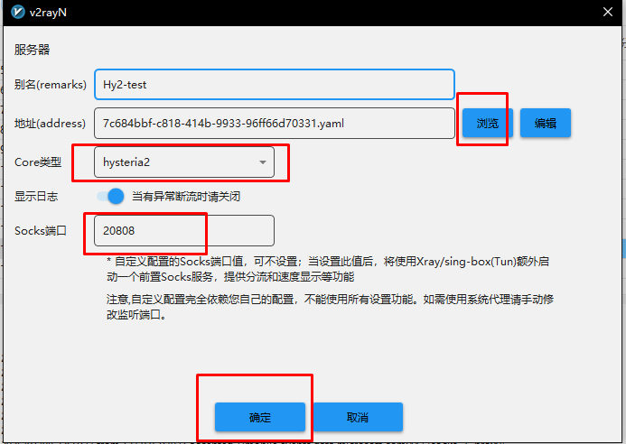

## 支持的客户端

[https://v2.hysteria.network/zh/docs/getting-started/3rd-party-apps/](https://v2.hysteria.network/zh/docs/getting-started/3rd-party-apps/)

### Tips

* V2rayN-windows可以直接扫描屏幕上的二维码。
* v2rayN可在自定义配置里添加hysteria2原生客户端配置文件，给予你原汁原味的体验。**如果使用自定义文件启动hysteria2，那么自定义socks端口请填写20808来使用v2rayN流量统计与分流功能**
v2rayN -> 服务器 ->添加自定义配置

* 需要发挥hysteria2最佳的性能需要在客户端如实填写当前网络下的下行上行带宽，以及填写客户端QUIC参数，如果该客户端不支持填写**请使用脚本生成的原生hysteria客户端配置**
* v2rayN For Andriod需要填写端口跳跃时间才能启动，不然会出错，默认是30s，推荐120s
* 如果没有使用obfs直接留空就行
* clash.meta目前最佳的方案就是生成一个配置文件，交由用户自行导入。或者你可以找订阅转化将url转成clash.meta可用的订阅
* nekobox/v2rayNForAndriod请在路由里面打开屏蔽QUIC功能，否则无法访问使用了http/3的网站。此问题由于服务器屏蔽了udp/443流量，hysteria对udp无增强的拥塞控制效果
