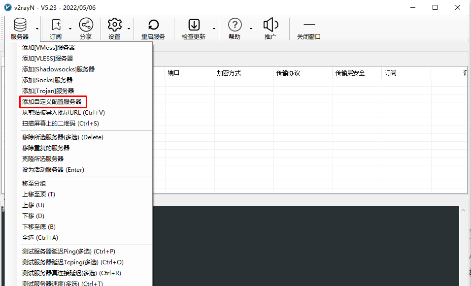
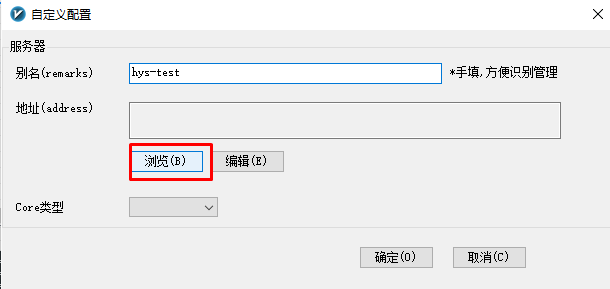
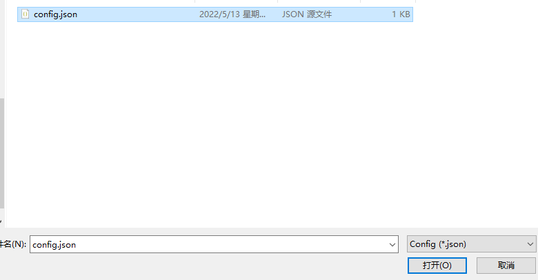
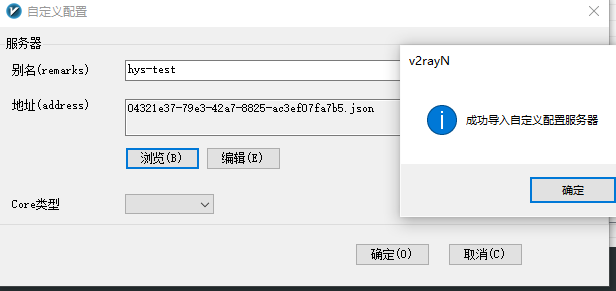
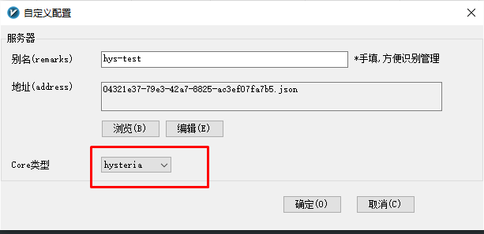
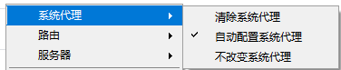
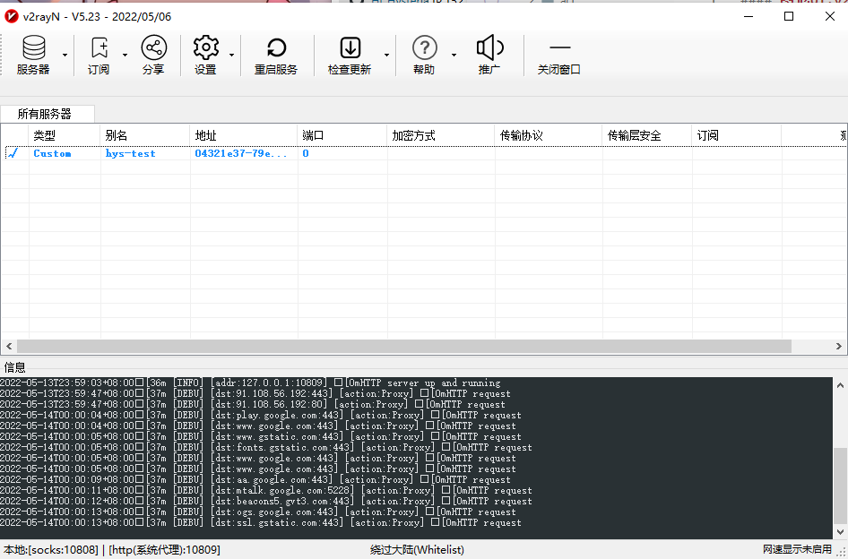
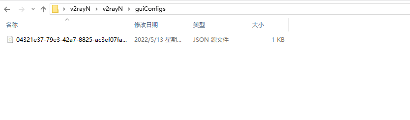

#### 图形UI,v2rayN

v2rayN已经在添加自定义配置时支持hysteria并能自动识别config的类型，hihy在`0.3.7`版本之后兼容v2rayN，hihy_cmd已经需要退出舞台了，**不会再对它进行维护**。

我将如何使用呢?你可以直接下载我打包好的[v2rayN-hysteriaCore](../client/windows/v2rayN/v2rayN-hysteriaCore.rar)

1. [点我下载](https://github.com/2dust/v2rayN/releases/latest/download/v2rayN.zip)最新的v2rayN，并解压。

2. [点我下载](https://github.com/HyNetwork/hysteria/releases/latest/download/hysteria-tun-windows-6.0-amd64.exe)hysteria最新版本的Core，修改名称为`hysteria.exe`,将它放到v2rayN的根目录里。
3. 使用提供的[脚本](https://github.com/emptysuns/Hi_Hysteria/tree/main/acl)生成acl文件和Country.mmdb文件,在v2rayN根目录创建一个新的文件夹名称为`acl`并将这两个文件放到这个目录里。
4. 开始使用时需要得到hihy生成的config.json配置文件，v2rayN选择这个文件，双击选择此节点。如下图:
   
* **保证有core和acl文件**

* **配置v2rayN hysteria**

* **看到下图则说明代理正常运行v2rayN hysteria**

* **从服务器下载的config.json可以删掉，v2rayN会自动在目录创建文件夹用来保存这些自定义配置文件**

5. **Hello World！**